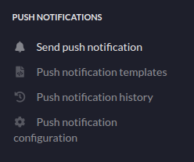
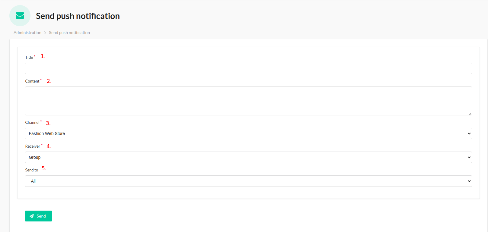
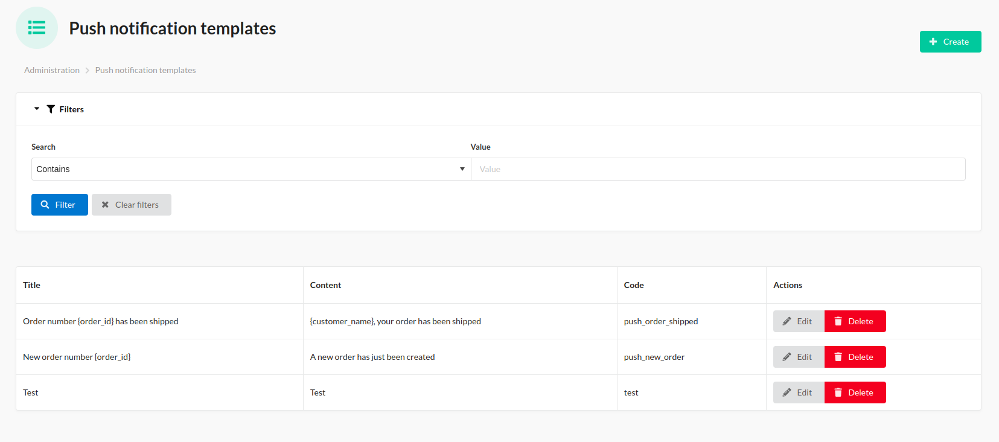
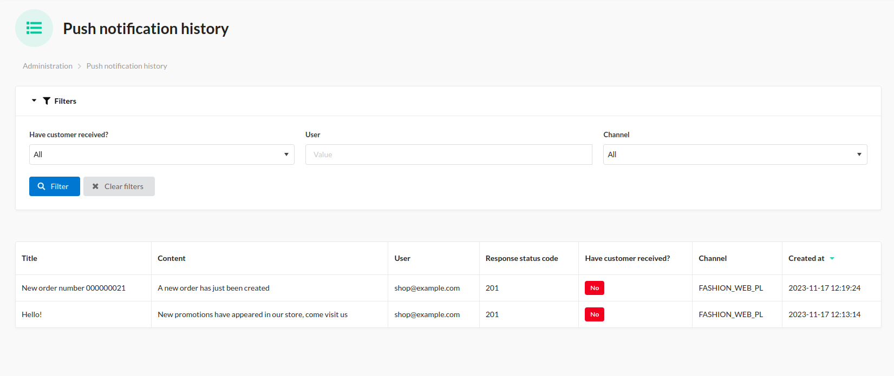
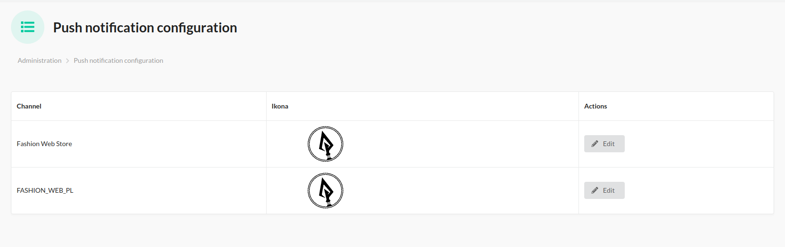

## Administrator Experience: 
1. New menu in the administration panel

    

2.Panel for sending push notifications to a user or group:
    

    1. Push notification title - required
    2. Push notification content - required
    3. Channel, push notifications are sent depending on the selected channel.
    4. You can send push notifications to a group or user.
    5. Here you select a defined group of users or a specific user to whom the push notification will be sent.
    

3. Here you define an object of the `SpearDevs\SyliusPushNotificationsPlugin\Entity\PushNotificationTemplate` class
   You can use these objects to send push notifications later
    

4. An example panel with push notification history:
    

5. Example panel with push notification configuration:
    
