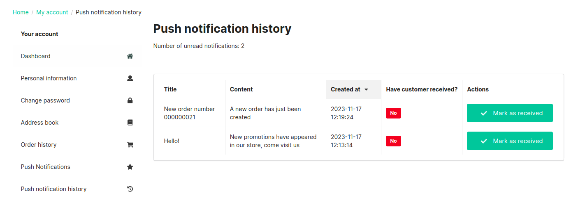

## Customer Experience: 
1. Push notifications will only be sent to users who have consented to them. The user can consent after logging in in the Push Notifications tab. At the address: `/account/push-notifications`.

2. All push notifications sent to the client are available in the Push notification history tab. At the address `/account/push-notifications-history`
    

3. An example of a push notification sent from the dekstop level.
    
